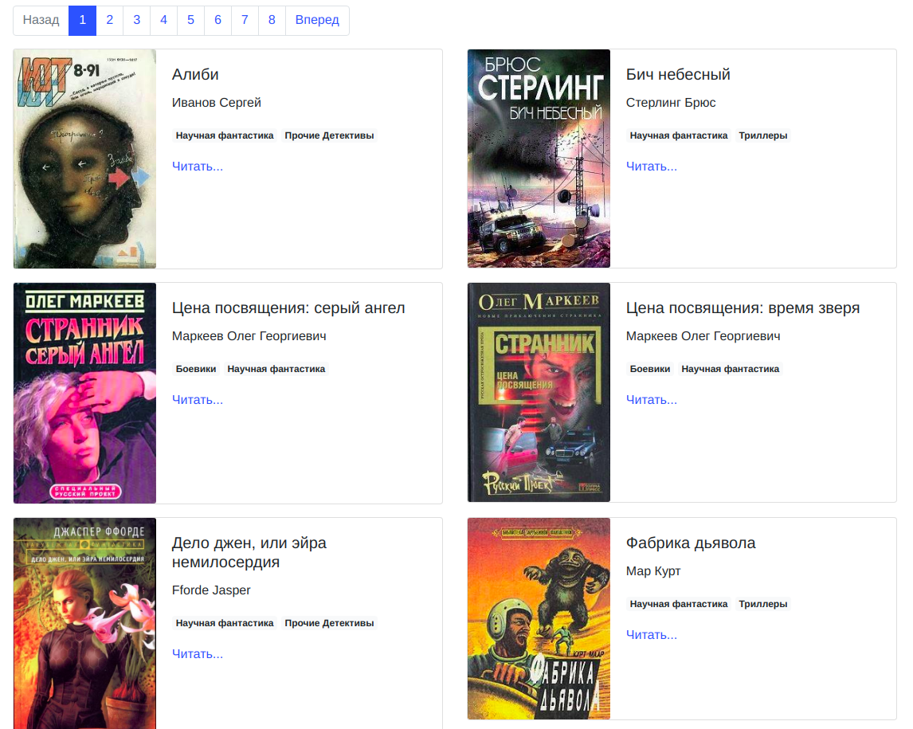

# Онлайн библиотека

Проект для создания своей онлайн-библиотеки

## Описание

Проект создает сайт с книгами из предварительно скачанных книг с сайта [http://tululu.org](http://tululu.org)

<a href='https://cok263.github.io/pub_library/'></a>

Чтобы перейти на пример онлайн-библиотеки перейдите по [ссылке](https://cok263.github.io/pub_library)

## Скачать оффлайн библиотеку

Для того, чтобы скачать оффлайн версию библиотеки требуется:
- скопируйте [репозиторий](https://github.com/cok263/pub_library) к себе на компьютер
- откройте файл index.html в браузере

Приятного чтения!

## Создаение своей библиотеки

Для запуска сайта у вас уже должен быть установлен Python 3.

Для создания сайта выполните следующие действия:
1. Скачайте код
2. Установите зависимости:
```sh
$ pip install -r requirements.txt
```
3. Скачайте репозиторий [парсера библиотеки](https://github.com/cok263/library) и, используя его описание, скачайте интересующие вас книги в папку [download](#Данные-для-библиотеки)
4. Скопируйте папку download в папку с кодом этого репозитория
5. Запустите сервер
```sh
$ python3 render_website.py
```
6. После этого переходите по ссылке [127.0.0.1:5500](http://127.0.0.1:5500), вы увидите главную страницу.

### Данные для библиотеки
Для генерации онлайн библиотеки скрип берет данные из папки download в корне проекта.
Информация о книгах содержится в файле books.json
```
[
  {
    "title": "Алиби",
    "author": "Иванов Сергей",
    "img_src": "download/images/239.jpg",
    "comments": [
      "Детский вариант анекдотов про Шерлока Холмса)",
      "Загадки я люблю.)))",
      "А мне понравилось, люблю, знаете ли, всякие загадочки, головоломочки, кроссвордики, Гимнастика ума, одним словом... \nВо всём можно найти положительные моменты, не разгадал загадку, так хоть гренки научился готовить отменные... :-)",
      "Очень поучительное для ребенка 10 лет."
    ],
    "genres": [
      "Научная фантастика",
      "Прочие Детективы"
    ],
    "book_path": "download/books/239. Алиби.txt"
  },
  ...
]
```

Тексты и обложки лежат в папках books и images соответственно.
```
download
│   books.json    
│
└───books
│   │   10768. Наложница императора.txt
│   │   10923. Общая теория доминант.txt
│   │   ...
│   
└───images
    │   10768.jpg
    │   10923.jpg
    │   ...
```

## Цели проекта

Код написан в учебных целях — это урок в курсе по Python и веб-разработке на сайте [Devman](https://dvmn.org).
